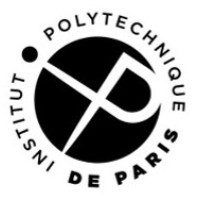

# **Guidogiorgio Bodrato**

I am a PhD Candidate in Economics at [**CREST**](https://crest.science) and [**Institut Polytechnique de Paris**](https://www.ip-paris.fr). My research focuses on fixed-income, covering both government and other securities in the primary and secondary markets.

### Education and Training
`r fontawesome::fa(name = "graduation-cap", fill = "steelblue")` 2021 (expected) - **PhD in Economics**, \
CREST & Institut Polytechnique de Paris.

`r fontawesome::fa(name = "graduation-cap", fill = "steelblue")`
2018 - **MRes in Economics**, \
ENSAE & Institut Polytechnique de Paris.

`r fontawesome::fa(name = "archway", fill = "steelblue")`
2017 - **Data and Statistics Traineeship**, \
European Securities and Markets Authority (ESMA).

`r fontawesome::fa(name = "graduation-cap", fill = "steelblue")`
2016 - **MA in Quantitative Economics**, \
ECARES, Solvay Business School, Université Libre de Bruxelles.

`r fontawesome::fa(name = "graduation-cap", fill = "steelblue")`
2013 - **BA in Business Economics**, \
Univerisità degli Studi di Torino.

&nbsp; 

You can download my full [**CV**](CV_Bodrato_April2021.pdf) here. \
`r fontawesome::fa(name = "envelope", fill = "steelblue")`
Contact me at **guidogiorgio.bodrato [at] polytechnique.edu**.

<a>
{width=70%}
{width=30%}

</a>

